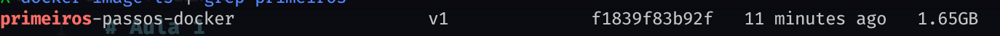
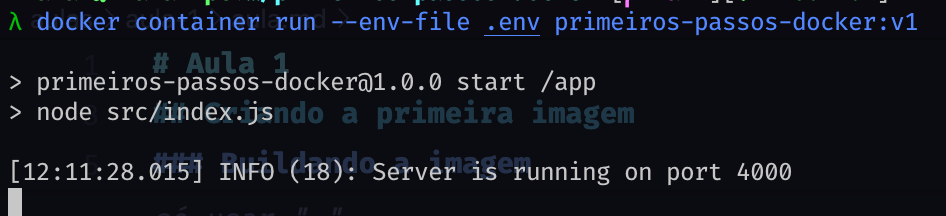
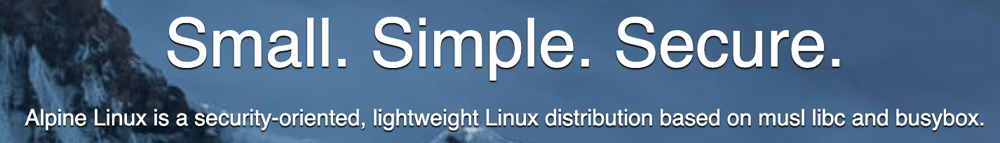
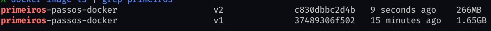

# Aula 1

## Syntax dos comandos Docker

WIP

## Criando a primeira imagem

### Buildando a imagem

Vamos criar a nossa primeira imagem Docker, para isso precisamos primeiro criar nosso Dockerfile, ele vai ficar mais ou menos assim:

```Docker
ARG NODE_VERSION=22 # ARG é tipo uma "variável" de build para o Dockerfile, aqui usaremos para "settar" a versão do Node

# syntax=docker/dockerfile:experimental
FROM node:${NODE_VERSION}

# Essa parte acabei só roubando da doc do PNPM, é como eles indicam, sei o que tá fazendo, porque é importante saber hahaha,
# mas aconselho sempre que for fazer alguma coisa no Docker pesquisar na internet se a ferramenta já não tem indicações
# olhar: https://pnpm.io/docker
ENV PNPM_HOME="/pnpm"
ENV PATH="$PNPM_HOME:$PATH"
RUN corepack enable

WORKDIR /app

COPY package.json pnpm-lock.yaml ./
# Mesma coisa aqui, a doc sugere isso, mas basicamente isso é pra fazer o esquema de cache do PNPM funcionar no Docker, assim deixando o install mais rápido
# se quiserem entender um pouco melhor:  https://pnpm.io/configuring e https://pnpm.io/motivation
RUN --mount=type=cache,id=pnpm,target=/pnpm/store pnpm install --prod --frozen-lockfile

COPY . .

ENTRYPOINT ["pnpm"]
CMD ["start"]
```

Para buildar a imagem bastar rodar o seguinte comando na raiz do projeto:

```bash
docker build -t <nome-da-imagem>:<versão> . # Em especial esse "." é o caminho do Dockerfile, no nosso ele já se encontra onde a gente tá, então só usar "."
```

Ao fazermos o build dessa imagem, chegamos no seguinte tamanho de image:



Um pouco grande, mas iremos retornar nisso depois

Notas:

- Não é boa prática levar o `.env` para dentro da imagem, se precisar

### Rodando o container

Agora que temos nossa imagem, precisamos rodar nosso container, para isso antes precisamos consultar as `Environment Variables` necessárias para o correto funcionamento deles.

Como podemos notar, nosso projeto tem um `.env.example`, que já é um "norte" para gente, mas o ideal mesmo é todo projeto ter um `README.md`, falando como rodar o projeto, variáveis, libs e apps necessários (fica de tarefa de casa fazer isso).

> **Nota:** Geralmente o que o pessoal faz é usar um carinha chamado `Makefile` que também funciona para isso. Uma alternativa que conheci recente é o `Taskfile`, bem bom também (https://taskfile.dev/)

Para "settar" nossas variáveis de ambiente existem duas maneiras:

1. Passamos variável por variável no argumento de run, exemplo: `docker container run -e DATABASE_USER=neondb_owner -e ... <imagem>`
2. Passamos um `.env` que tem as variáveis, exemplo: `docker container run --env-file .env <imagem>`

Iremos de comando `2.`, ao usar ele rodando `docker container run --env-file .env primeiros-passos-docker:v1`, **voilà**, funcionando:



### Melhorando nossa imagem

Como foi falando em [buildando a imagem](#buildando-a-imagem), nossa imagem está meio grande, em vários cloud providers temos um limite de free tier sendo 500mb, já iriamos passar disso na nossa primeira imagem (fora o fato de quantidade de dados trafegados na rede se a imagem é maior, o que gera custos e pipipopo...), portanto é importante fazermos otimizações na imagem.

A primeira e mais trivial é usar uma imagem `alpine`, mas o que diabos é `alpine`? Em resumo é uma versão/distro de linux super leve, como o próprio site deles sugere:



Nosso `Dockerfile` ficam assim:

```Docker
ARG NODE_VERSION=22-alpine # Alterado aqui

# syntax=docker/dockerfile:experimental
FROM node:${NODE_VERSION}

ENV PNPM_HOME="/pnpm"
ENV PATH="$PNPM_HOME:$PATH"
RUN corepack enable

WORKDIR /app

COPY package.json pnpm-lock.yaml ./
RUN --mount=type=cache,id=pnpm,target=/pnpm/store pnpm install --prod --frozen-lockfile

COPY . .

ENTRYPOINT ["pnpm"]
CMD ["start"]
```

Ao trocarmos para `alpine` nossa imagem fica em:



Saimos de `1.65GB` para `266MB`, uma melhoria fantastica!!! 🎉🎉🎉

> **Nota**: Outra melhoria possível é usar `Multi Stage Build`, mas nesse caso não teremos uma melhoria muito grande, porque não temos um processo de build, então não vou apresentar no momento, mas no futuro podemos retornar nesse cara.

Além disso, por questão de seguranção, não rodar nosso container como `root`, é importante fazer nossa imagem usar um usuário, por padrão as imagens `node` criam o usuário `node`, com menos privilégio, então bastante mudarmos nossa imagem para:

```Docker
ARG NODE_VERSION=22-alpine

# syntax=docker/dockerfile:experimental
FROM node:${NODE_VERSION}

ENV PNPM_HOME="/pnpm"
ENV PATH="$PNPM_HOME:$PATH"
RUN corepack enable

WORKDIR /app

COPY package.json pnpm-lock.yaml ./
RUN --mount=type=cache,id=pnpm,target=/pnpm/store pnpm install --prod --frozen-lockfile

COPY . .

USER node # Alteramos aqui

ENTRYPOINT ["pnpm"]
CMD ["start"]
```

## Rodando nosso banco localmente

### Tentando rodar apontando para o localhost

WIP

### Explicado um pouco sobre isolamento de network de um container

WIP

### Tentando conectar com o banco localmente mais uma vez

WIP

### Criando nossa primeira network

WIP

### Conectando com nossa network

WIP

## Criando documentação/pipeline para tudo
